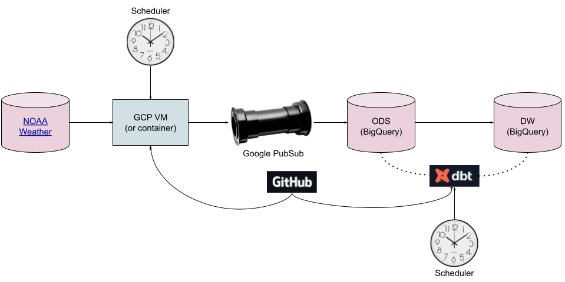

# DBT demonstration with GCP
This code uses the following technologies:
- Python and the [requests](https://requests.readthedocs.io/en/latest/) module
- Google [PubSub](https://cloud.google.com/pubsub)
- Google [BigQuery](https://cloud.google.com/bigquery)
- [DBT (Cloud version)](https://cloud.getdbt.com)

# Data Flow
- I fetch a) weather station, b) weather measurement type (what the NOAA calls the datatype) and c) measurements from the NOAA REST API. I publish this information as messages to a Google PubSub topic.
  - See [fetch.py](fetch.py).
  - This code can run on a VM, [Google Cloud Run](https://cloud.google.com/run/) instance, or a GKE cluster. I think a GKE cluster is overkill for this workload. A Google Run instance is a nice step up from a VM. It would take it's code directly from GitHub.
  - With a VM I schedule with crontab. With a Google Cloud Run instance I would schedule with [Google Cloud Scheduler](https://cloud.google.com/scheduler).
  - All messages are sent to a single PubSub topic, distinguished by the record type.
- I configured the Google PubSub topic to write the messages directly to a Google BigQuery table.
  - The 5-column [target table schema](sql/weather_ods.source.sql) is [defined by Google](https://cloud.google.com/pubsub/docs/bigquery#properties_subscription).
  - You can also [manipulate the data with Google DataFlow](https://cloud.google.com/dataflow/docs/tutorials/dataflow-stream-to-bigquery) before it lands in BigQuery. I prefer to go straight to a BigQuery table (or cloud storage) rather than add a step which could cause a failure.
  - I created three [views](sql) to unpack the binary JSON and separate the three message types (station, measurement type and measurement).
- DBT fetches the SQL-like code stored in GitHub, generates the equivalent BigQuery-specific SQL, and executes the statement against my BigQuery database.
  - [General configuration](dbt_project.yml)
  - [Stations](models/weather/station_dim.sql)
  - [Measurement types](models/weather/measurement_type_dim.sql)
  - [Measurements](models/weather/measurement.sql)
  - [Temperatures](models/weather/temperature.sql)
    - The real magic of DBT happens here: because I have defined temperature data to rely on station, measurement type and measurement, it knows to load that foundational data first, *then* it loads the temperature data.

# Potential improvements
- Run on a schedule via Google Run.
- Use protobufs (https://protobuf.dev/)
- ~~The NOAA API limits results to 1000 items; add code to paginate to get all records.~~
- Query the database to determine what date to start from (right now we just assume we will run at least every 7 days).
- Put credentials file, logging level, etc. into a config file.
- Put credentials file and NOAA REST API token into Google Secrets Manager.
- Add comments to DDL.
- Use https://google-auth.readthedocs.io/en/latest/reference/google.auth.credentials.html#google.auth.credentials.Credentials to authenticate.
- Create surrogate keys for stations (see https://discourse.getdbt.com/t/can-i-create-an-auto-incrementing-id-in-dbt/579/2 and https://docs.getdbt.com/blog/managing-surrogate-keys).
- Do something interesting with the temperature table, maybe analysis of temperature vs. elevation or latitude.
- Performance:
  - As weather_ods.measurement grows performance might degrade.
  - Add clustering key.
