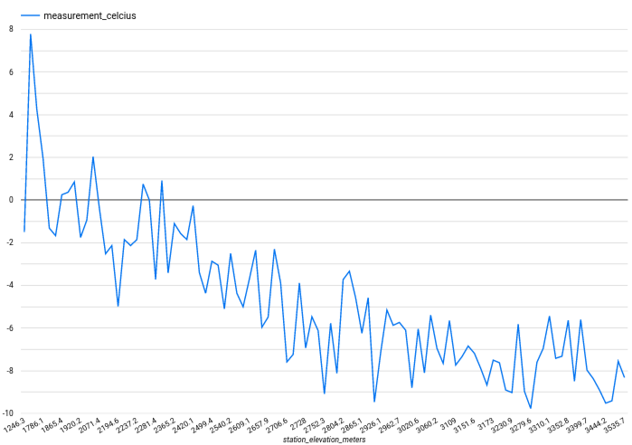

# DBT demonstration with GCP
This code uses the following technologies:
- Python and the [requests](https://requests.readthedocs.io/en/latest/) module
- Google [PubSub](https://cloud.google.com/pubsub)
- Google [BigQuery](https://cloud.google.com/bigquery)
- [DBT (Cloud version)](https://cloud.getdbt.com)

# Data Flow
- I fetch a) weather station, b) weather measurement type (what the NOAA calls the datatype) and c) measurements from the NOAA REST API. I publish this information as messages to a Google PubSub topic.
  - See [fetch.py](fetch.py).
  - This code can run on a VM or a container such as [AWS Fargate](https://aws.amazon.com/fargate/) or [Google Cloud Run](https://cloud.google.com/run/).
  - With a VM I schedule with crontab. With Fargate or Cloud Run I would schedule with [EventBridge](https://docs.aws.amazon.com/AmazonECS/latest/userguide/scheduled_tasks.html) or [Google Cloud Scheduler](https://cloud.google.com/scheduler).
  - All messages are sent to a single message queue topic (Google PubSub, could also use [AWS SQS](https://aws.amazon.com/sqs/), distinguished by the record type.
- I configured the Google PubSub topic to write the messages directly to a Google BigQuery table.
  - The 5-column [target table schema](sql/weather_ods.source.sql) is [defined by Google](https://cloud.google.com/pubsub/docs/bigquery#properties_subscription).
  - You can also [manipulate the data with Google DataFlow](https://cloud.google.com/dataflow/docs/tutorials/dataflow-stream-to-bigquery) before it lands in BigQuery. I prefer to go straight to a BigQuery table (or cloud storage) rather than add a step which could cause a failure.
  - I created three [views](sql) to unpack the binary JSON and separate the three message types (station, measurement type and measurement).
- DBT fetches the SQL-like code stored in GitHub, generates the equivalent BigQuery-specific SQL, and executes the statement against my BigQuery database.
  - [General configuration](dbt_project.yml)
  - [Stations](models/weather/station_dim.sql)
    - Because we may have multiple source rows for each station this query selects the last row for each station.
  - [Measurement types](models/weather/measurement_type_dim.sql)
    - Because we may have multiple source rows for each measurement type this query selects the last row for each measurement type.
  - [Measurements](models/weather/measurement.sql)
    - Because we may have multiple source rows for each measurement this query selects the last row for each measurement.
  - [Temperatures](models/weather/temperature.sql)
    - The real magic of DBT happens here: because I have defined temperature data to rely on station, measurement type and measurement, DBT knows to load that foundational data first, *then* it loads the temperature data.
- DBT tests
  - [Tests](models/weather/weather.yml)
    - Verifies the primary keys for each dimension table are non-null and unique.

## Visualization
Neither Tableau nor Looker provide a permanently free tier I used Google Data Studio to plot average temperature v. elevation.
The [results](https://lookerstudio.google.com/reporting/111a125b-70ab-49d0-ad71-456c93d47bf4) are as I expected: as you go up, temperature goes down.

## Architecture
In the diagram below the ODS and DW are shown as different databases, but it is a logical separation only.
- In Snowflake and Redshift these would be two databases in the same database cluster or two schemas in the same database.
- In BigQuery these would be two datasets in the same project or two schemas in the same dataset.

DBT is generating and executing the SQL which selects from ODS and DW tables and writes to DW tables.

# Potential improvements
- Run on a schedule via Fargate or Google Run.
- Use protobufs (https://protobuf.dev/)
- ~~The NOAA API limits results to 1000 items; add code to paginate to get all records.~~
- ~~Log to Google Cloud logging.~~
- Query the database to determine what date to start from (right now we just assume we will run at least every 7 days).
- Put credentials file, logging level, etc. into a config file.
- Put credentials file and NOAA REST API token into Google Secrets Manager.
- Add comments to DDL.
- Use https://google-auth.readthedocs.io/en/latest/reference/google.auth.credentials.html#google.auth.credentials.Credentials to authenticate.
- Create surrogate keys for stations (see https://discourse.getdbt.com/t/can-i-create-an-auto-incrementing-id-in-dbt/579/2 and https://docs.getdbt.com/blog/managing-surrogate-keys).
- ~~Do something interesting with the temperature table, maybe analysis of temperature vs. elevation or latitude.~~
- Performance:
  - As weather_ods.measurement grows performance might degrade.
  - Add clustering key.
